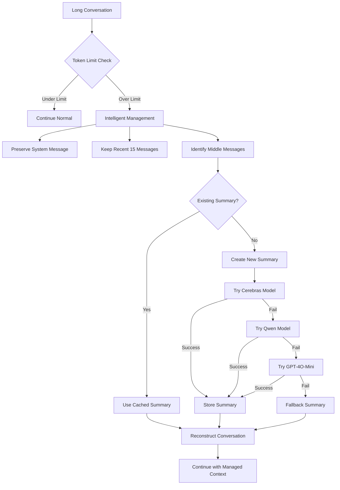

# 🧠 Cloud-Native Intelligent Conversation Memory System

## Overview

The **Cloud-Native Intelligent Conversation Memory System** prevents token limit errors by using AI-powered summarization with **Weaviate** storage. Designed for **Google Cloud Run deployment** with **frontend-managed conversations** in `ai_chat_dock.cpp`.

## ✨ Features

### 🤖 AI-Powered Summarization
- Uses specialized models like **Cerebras GPT-OSS-120B** and **Qwen-3-Coder-480B** for intelligent summarization
- Preserves technical context, code changes, and problem-solving patterns
- Creates rich summaries that maintain conversation continuity

### 🎯 Smart Management  
- **Automatic detection** of token limit approaching
- **Preserves recent context** (last 15 messages by default)
- **Intelligent pruning** of middle conversation sections
- **Fallback system** if AI summarization fails

### 💾 Persistent Storage
- SQLite database stores summaries for reuse
- Deduplication prevents duplicate summaries
- Cleanup routines prevent database bloat

## 🚀 Usage

### Automatic Operation
The system works automatically - no user intervention needed:

```python
# In your conversation flow, this happens automatically:
conversation_messages = await conversation_memory.manage_conversation_length(
    messages, model, user_id
)
```

### Manual Control via API

#### Get Memory Statistics
```bash
GET /memory_stats
```
Returns usage statistics for different models and summarization effectiveness.

#### Cleanup Old Summaries  
```bash
POST /memory_cleanup
{
  "days_old": 30  # Optional, defaults to config value
}
```

## ⚙️ Configuration

### Environment Variables

Add to your `.env` file:

```bash
# Enable/disable intelligent memory management
ENABLE_INTELLIGENT_MEMORY=true

# Custom summarization models (comma-separated, in order of preference)  
MEMORY_SUMMARIZATION_MODELS=cerebras/gpt-oss-120b,together_ai/Qwen2.5-Coder-32B-Instruct,openai/gpt-4o-mini

# Database path for conversation summaries
MEMORY_DB_PATH=./data/conversation_memory.db

# Custom summary prompt template (optional)
MEMORY_SUMMARY_PROMPT=Your custom prompt here...
```

### Model Configuration

The system tries models in this order:
1. **Cerebras GPT-OSS-120B** - Fast, efficient summarization
2. **Qwen-3-Coder-480B** - Excellent for code context
3. **GPT-4O-Mini** - Cost-effective fallback

### Token Limits

Configured per model with safety margins:

| Model | Limit | Safety Margin |
|-------|--------|---------------|
| Claude Sonnet 4 | 180k | 20k |
| GPT-5 | 120k | 8k |
| GPT-4O | 120k | 8k |
| Cerebras GPT-OSS-120B | 7k | 1k |
| Qwen-3-Coder | 30k | 2k |

## 📊 How It Works



## 🛠️ Architecture

### Core Components

1. **ConversationMemoryManager** - Main orchestration class
2. **MemoryConfig** - Configuration management  
3. **SQLite Database** - Persistent summary storage
4. **API Endpoints** - Manual control and monitoring

### Files Structure

```
backend/
├── conversation_memory.py    # Main memory management logic
├── memory_config.py         # Configuration management
├── app.py                   # Updated with memory integration
└── conversation_memory.db   # SQLite database (auto-created)
```

## 📈 Benefits

### 🚫 Prevents Errors
- No more "Token limit exceeded" crashes
- Seamless conversation continuation
- Automatic recovery from context overflow

### 🎯 Maintains Quality
- Preserves important technical context
- Smart summarization using coding-aware models
- Recent messages always kept for immediate relevance

### ⚡ Performance
- Reduces API call token usage
- Faster processing with smaller contexts
- Caches summaries for reuse

### 💰 Cost Efficiency
- Uses efficient models for summarization
- Prevents expensive failed API calls
- Optimizes token usage across conversations

## 🔍 Monitoring

### Log Messages
```
MEMORY_MANAGE: Token count 201119 exceeds limit 180000, managing conversation
MEMORY_SUMMARY: Attempting summarization with cerebras/gpt-oss-120b
MEMORY_SUMMARY: Successfully created summary with cerebras/gpt-oss-120b (347 chars)
MEMORY_MANAGE: Reduced from 201119 to 45230 tokens (367 to 18 messages)
```

### Statistics API
Use `GET /memory_stats` to monitor:
- Total summaries created
- Average messages summarized per session
- Model usage patterns
- Summary effectiveness metrics

## 🚨 Troubleshooting

### Summarization Fails
- System automatically tries multiple models
- Falls back to simple structured summary
- Continues operation without interruption

### Database Issues  
- Auto-creates database if missing
- Handles connection failures gracefully
- Provides manual cleanup endpoints

### Configuration Problems
- Uses sensible defaults if config missing
- Environment variables override defaults
- Extensive logging for debugging

## 🔬 Advanced Usage

### Custom Summary Prompts
Override the default prompt for domain-specific summarization:

```python
MEMORY_SUMMARY_PROMPT = """
Create a summary focusing on:
1. Unity-to-Godot migration patterns
2. Performance optimization decisions  
3. Asset pipeline configurations
...
"""
```

### Model Prioritization
Customize which models to use:

```python
MEMORY_SUMMARIZATION_MODELS = "together_ai/Qwen2.5-Coder-32B-Instruct,cerebras/gpt-oss-120b"
```

This intelligent memory system ensures your Godot AI assistant can handle long conversations while maintaining context quality and preventing token limit errors! 🎮✨
